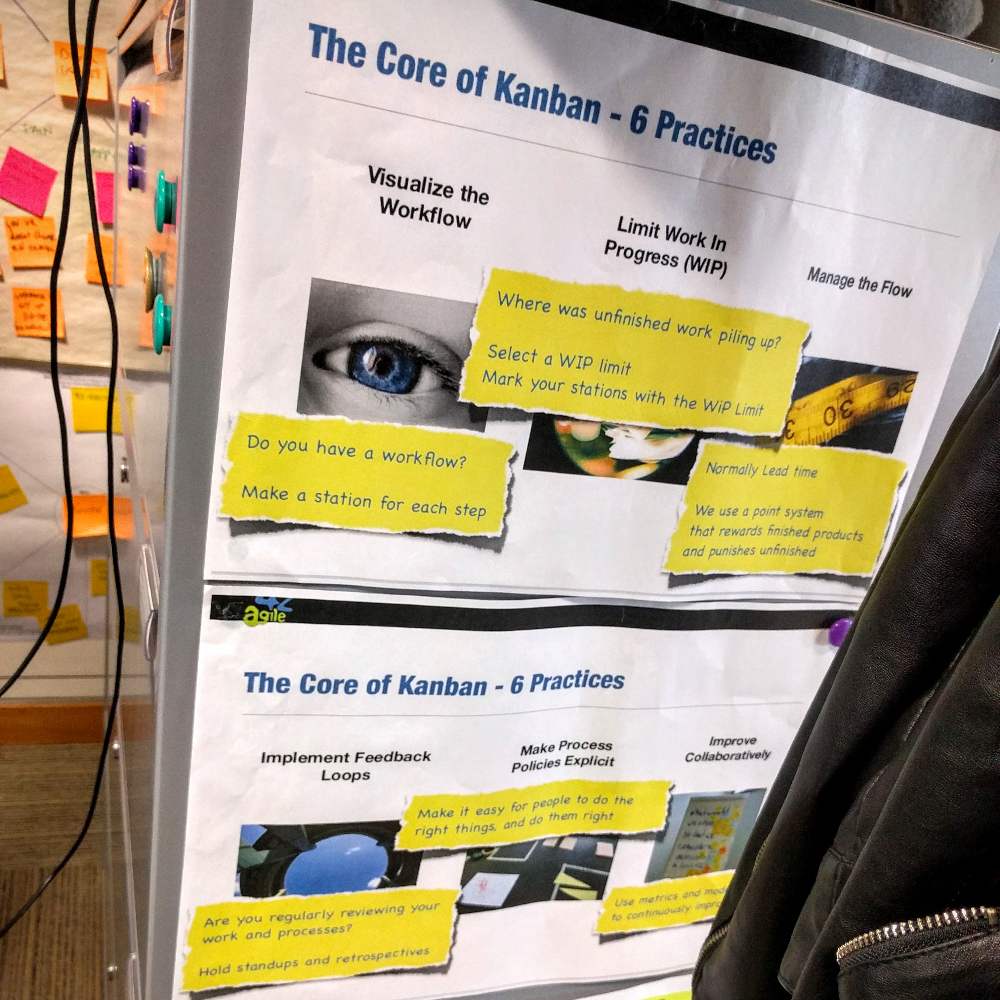
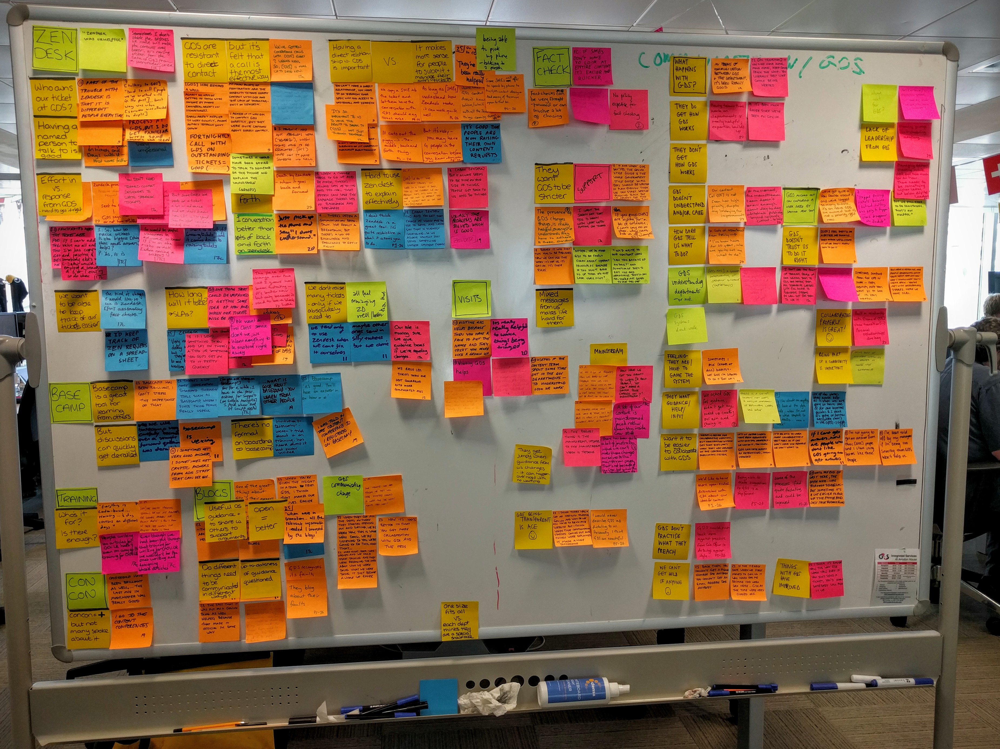
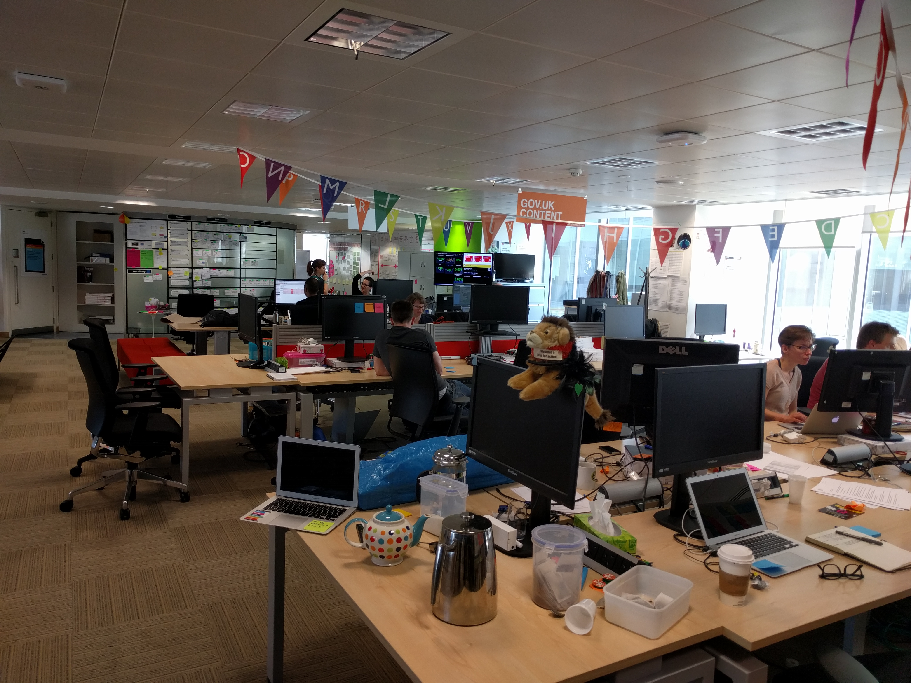
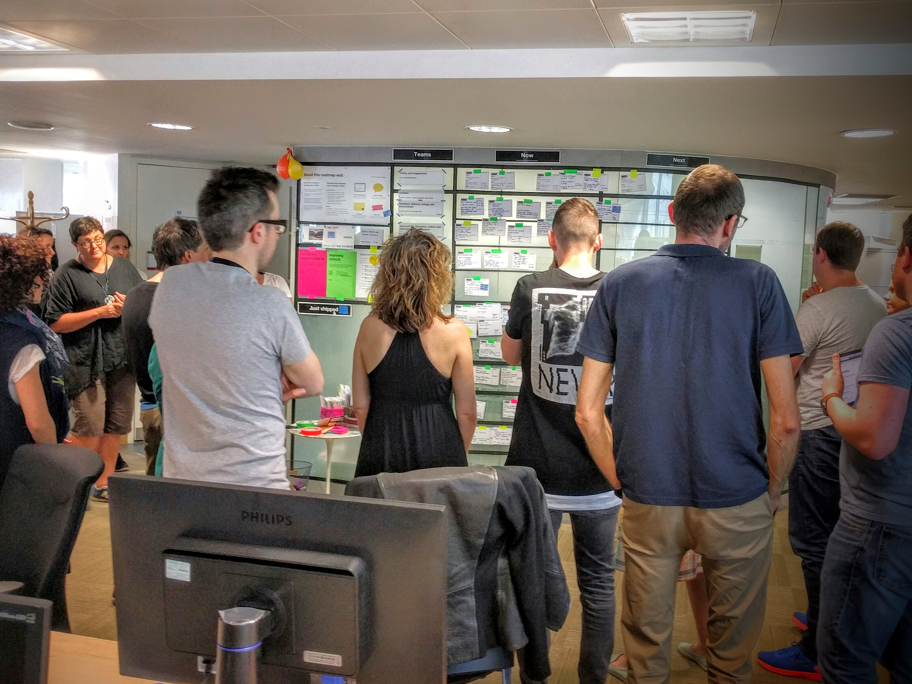
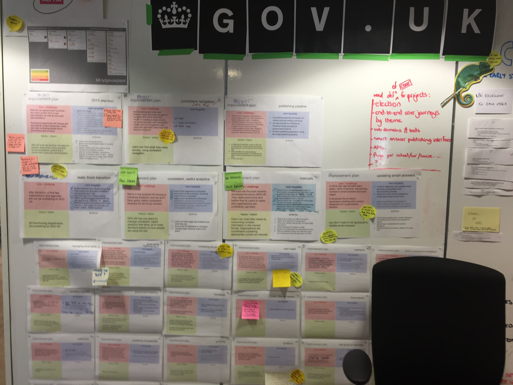
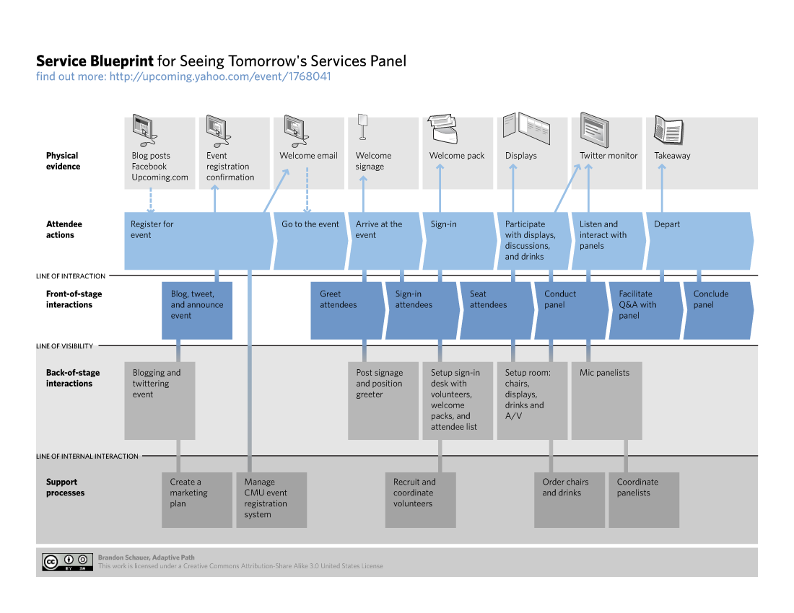
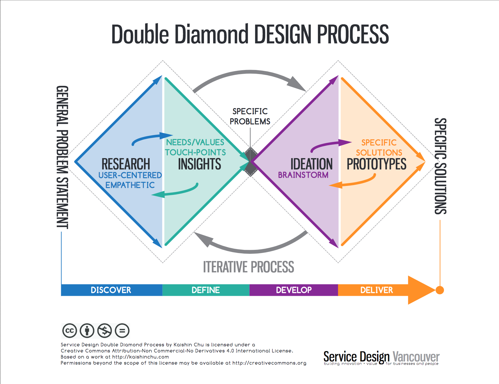
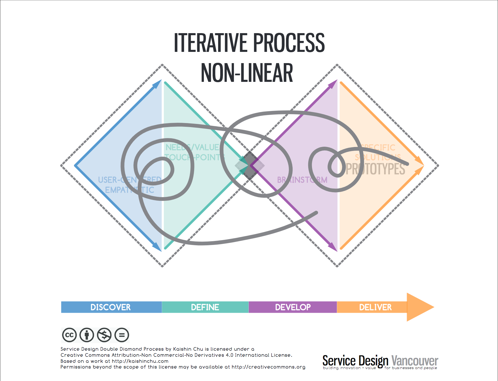

##

(Originalinhalte von Mike Atherton, Padma Gillen, Jennifer McCutchen und anderen)

## Im Fokus:

Touchpoints

Systeme

Inhaltsqualität

##

>  HOW DO WE DESIGN SERVICE EXPERIENCES THAT MEET OUR LIQUID EXPECTATIONS … AND INTEGRATE ALL THESE SYSTEMS … ACROSS ALL THESE TOUCHPOINTS … WITHOUT RELYING ON MORE MEDIOCRE CONTENT?

[ HOW DO WE DESIGN SERVICE EXPERIENCES THAT MEET OUR LIQUID EXPECTATIONS … AND INTEGRATE ALL THESE SYSTEMS … ACROSS ALL THESE TOUCHPOINTS … WITHOUT RELYING ON MORE MEDIOCRE CONTENT? ](https://de.slideshare.net/jennicolem/content-strategy-in-service-design/15)

# Beispiel gov.uk

## Service-orientiertes Angebot

## [Welcome to GOV.UK](https://www.gov.uk/)

Album: https://goo.gl/photos/tvo8Tbo222d6E4Ly5

## Digital by default

## Start with user needs

[Service Manual - GOV.UK](https://www.gov.uk/service-manual)

Quelle: [User needs and revolutions - Government Digital Service](https://gds.blog.gov.uk/2014/04/23/user-needs-and-revolutions/) Rechte: [Open Government Licence](https://www.nationalarchives.gov.uk/doc/open-government-licence/version/3/)

[Agile delivery - Service Manual - GOV.UK](https://www.gov.uk/service-manual/agile-delivery)

## Laufendes Feedback

## Agile Arbeitsweise

## Agile Arbeitsweise in großen Teams

## Laufende interne Verbesserung

## Transparenz

[GOV.UK blogs](https://www.blog.gov.uk/)

# Service Design

##

> Service Design is

> The planning and organization of people, infrastructure, communications and touchpoints needed to facilitate successful services. It strategically addresses the complexity of today’s multitouchpoints in terms of human experiences.

[[Content Strategy in Service Design](https://de.slideshare.net/jennicolem/content-strategy-in-service-design/25)]

##

> “When you have two coffee shops right next each other, and each sells the exact same coffee at the exact same price, service design is what makes you walk into one and not the other.”
> SERVICE DESIGN DONE WELL

[“When you have two coffee shops right next each other, and each sells the exact same coffee at the exact same price, service design is what makes you walk into one and not the other.” SERVICE DESIGN DONE WELL ](https://de.slideshare.net/jennicolem/content-strategy-in-service-design/28)

##

Quelle: Brandon Schauer, Adaptive Path [Service blueprint for Service Design panel | You can view it… | Flickr](https://www.flickr.com/photos/brandonschauer/3363169836/)

Rechte: [Creative Commons — Attribution-ShareAlike 2.0 Generic — CC BY-SA 2.0](https://creativecommons.org/licenses/by-sa/2.0/)

##

> ANATOMY OF A SERVICE

> Content is created and consumed by people, but it is managed through the same complex web of backstage systems and processes. Content is experienced through touchpoints. A piece of content may exist on only only one touchpoint, or it may travel between touchpoints. The sum of this content across all touchpoints comprises a content experience. How well this content works — or doesn’t work — across the entire ecosystem affects the quality of the service experience. The quality of the service experience directly relates to the quality of the brand.

> CONTENT WITHIN A SERVICE

> Services come to life through people, but they’re dependent on a complex web of backstage systems and processes. People interact with a service via touchpoints. The sum of all of these touchpoints comprises a service experience. The perception of the service experience directly relates to the perception of the brand.

[content-strategy-in-service-design-30-638.jpg (JPEG-Grafik, 638 × 359 Pixel)](https://image.slidesharecdn.com/contentstrategyinservicedesign-160428213507/95/content-strategy-in-service-design-30-638.jpg?cb=1462834159)

[Content Strategy in Service Design](https://de.slideshare.net/jennicolem/content-strategy-in-service-design/30)

- Inhalte ermöglicht und vereinfacht Dienste
- Inhalt macht die Erfahrung von Diensten einheitlich und ganzheitlich

## Entwurfsprozess

[Content Strategy in Service Design](https://de.slideshare.net/jennicolem/content-strategy-in-service-design/30)

Discover - Define- Develop-Deliver

# Methoden

## Directed Storytelling

> Assign 1 person in your group to be “storyteller” and 1 person to be the “interviewer.” •  STORYTELLER (1 person): Describe the process of getting to today’s Meetup. Walk through every step in excruciating detail.* •  INTERVIEWER (1 person): Ask the storyteller open-ended questions about the process. Keep the conversation going. (“Yes, And …” may come in handy!) •  NOTETAKERS (Rest of group): Using Post-its, document the details from the story. Keep it to 1 idea per Post-It. DIRECTED STORYTELLING (5 MIN.)

[Content Strategy in Service Design](https://de.slideshare.net/jennicolem/content-strategy-in-service-design/73)

## Affinity Diagram

> 1.  One by one, combine each notetaker’s Post-its into one diagram, grouping similar ideas together. 2.  Collaborate as group to agree on clusters and then name the clusters. 3.  Vote on the top three themes from the clusters that could differentiate the service experience if it was reimagined. AFFINITY DIAGRAM (5 MIN.)

[Content Strategy in Service Design](https://de.slideshare.net/jennicolem/content-strategy-in-service-design/74)

## Customer Journey Mapping

> 1.  Using the documented research as guidance, identify each stage of the Current State user journey. 2.  Identify the user’s actions, touchpoints, thoughts/emotions and any other relevant stakeholders. 3.  Identify the frontstage content elements -- content needs, content types and formats, channels and key messages. 4.  IF TIME PERMITS: Focus on one or two areas of opportunity that would improve the experience. UNDERSTAND THE USER JOURNEY (15 MIN)

[Content Strategy in Service Design](https://de.slideshare.net/jennicolem/content-strategy-in-service-design/75)

# Contentstrategie und Content-Marketing

## outside-in statt Inside-out-Marketing

> “You listen for the needs of your clients and you build messages that serve those needs, on and in their terms,” said Mathewson, a distinguished technical marketer for search at IBM. “Then you place these messages in convenient places in their buyer journeys – typically search and social media settings. The messages attract them to your owned content marketing properties, where you can more deeply engage them, and ultimately convert them into loyal clients. This engagement initially takes the form of conditioning the conversation towards your brands and differentiating propositions, but ends in a strong relationship built on trust.”

[B2B Best Practices: Content marketing with James Mathewson & Mike Moran - B2B News Network](https://www.b2bnn.com/2016/05/b2b-best-practices-content-marketing-with-james-mathewson-mike-moran/)

# Durch Inhalte werden Services entdeckbar

# Durch Inhalte werden Services verbreitet

# Inhalte zur Außenkommunikation bauen auf Inhalten als Komponenten eines Service auf

# Durch Inhalte werden Services verständlich
